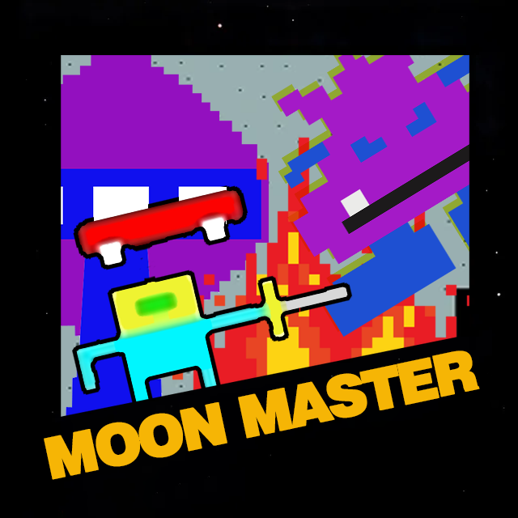

# [Click Here to Play!](https://htmlpreview.github.io/?https://github.com/0hmyTVC15/moon-master-hd/blob/56b5f483ad93e2909ac3f84eff5756ceacdf4477/builds/ver%201.0.x/moon-master-1.4.2.html)
Work in Progress | Desktop / Keyboard Recommended

# Moon Master HD: Beware the Gorgatron

A fast, silly, 4-bit-style browser game loosely inspired by the “Moon Master” gag from Aqua Teen. It’s a fan-made parody: simple shapes, crunchy SFX, and steadily escalating chaos. Survive waves, fight boss Gorgatron, and spend your score on power-ups to push deeper.

## Play
- **Desktop (recommended):** Open `index.html` in a modern browser (Chrome, Edge, Firefox, Safari).
- **Mobile:** The build aims to be mobile-friendly in a single HTML file. Performance and touch controls may vary by device. It is still being refined.

> Tip: Some browsers won’t play audio until you’ve pressed a key or tapped the screen. Currently, the game plays better on desktop with a keyboard.

## Features
- **Retro 4-bit look:** No external assets; everything is drawn as solid-color primitives.
- **Progression & pacing:** New enemy types appear as you advance (e.g., **spaceships from ~Level 7**, **ground crabs from ~Level 15**), with faster projectiles and denser patterns over time.
- **Boss encounters:** **Gorgatron** returns with simple animations and nasty, hammer-bro-style yellow arcs.
- **Shop & power-ups:** Your **score is your currency**. Buy items between waves; key power-ups include **enemy slow** and a **“remove two enemies”** screen clear. Power-ups currently last **~10 seconds**.
- **Checkpoints:** Each level checkpoint appears as a **gold key**.
- **Title flair:** Projectiles orbit and bounce on the **title screen** for ambiance.
- **Debug level select:** On the **title screen, press `L`** to open a basic level-select/debug menu.

## Controls
- **Move:** Arrow Keys  
- **Shoot:** Space Bar / X
- **Jump:** Up Arrow Key
- **Level Select:** Press **L** on the title screen

## Gameplay notes
- Colliding with enemies **resets your run** (arcade-style).  
- Difficulty **ramps meaningfully after ~Level 25** as key will start moving.
- Levels are lightweight and repeatable; expect increasingly dense bullet patterns and tighter dodging.
> Tip: It is hard, but not impossible. It is meant to be comically frustrating and should feel like Cuphead or retro shoot-em ups.

## Host
- [Click this link for the most current build](https://htmlpreview.github.io/?https://github.com/0hmyTVC15/moon-master-hd/blob/56b5f483ad93e2909ac3f84eff5756ceacdf4477/builds/ver%201.0.x/moon-master-1.4.2.html)
- Intructions located in bottom left hand corner.
< All assets are generated via javascript, css and html. It is a self-contatined file.

## Known issues / quirks
- Audio may require an initial input.
- On some mobile browsers, touch input and on-screen buttons may overlap UI at small sizes.
- There may be too many enemies after level 30. Waiting for feedback before implimenting change.

## Roadmap
- More SFX polish and mix pass  
- Additional enemy patterns after New Game + modes. 
- Optional accessibility toggles (color variants)  
- Optimize save settings
- Difficulty tweaking
- QC / Feedback from r/AquaJail

## Credits
- **Design & development:** u/OhmyTVC15
- Special thanks to friends and r/AquaJail who gave feedback on difficulty, UI layout, and performance.

## Disclaimer
This is a **fan-made parody video game**. It is **not affiliated with Adult Swim, Aqua Teen Hunger Force, or any related rights holders.** All references are for parody and educational purposes only. This will never be sold, distribute or generate revenue of any kind as an official product in its current form.
